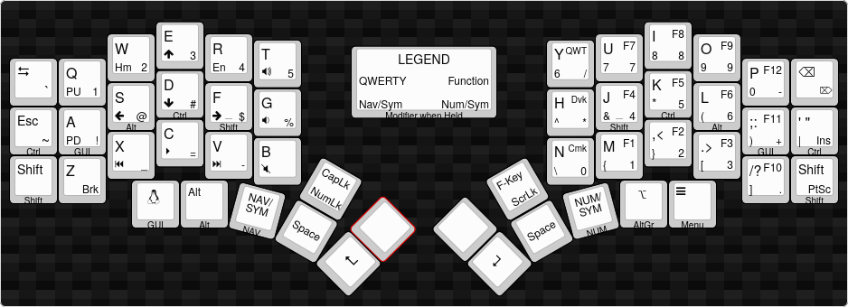

# Nev's Kyria Keymap




The default keymap contains 5 layers which allows it to include all keys found on an ANSI layout TKL keyboard plus media keys.
Hardware features of the Kyria such as OLEDs, rotary encoders and underglow are also supported.

The five different layers are the following:
1. Base layer (QWERTY, Colemak-DH or Dvorak)
2. Navigation layer
3. Symbols/Numbers layer
4. Function layer

## Base layer(s)
```
Base Layer: -

,-------------------------------------------.                              ,-------------------------------------------.
|  Tab   |   -  |   -  |   -  |   -  |   -  |                              |   -  |   -  |   -  |   -  |   -  |  Bksp  |
|--------+------+------+------+------+------|                              |------+------+------+------+------+--------|
|Ctrl/Esc|   -  |   -  |   -  |   -  |   -  |                              |   -  |   -  |   -  |   -  |   -  |Ctrl/' "|
|--------+------+------+------+------+------+-------------.  ,-------------+------+------+------+------+------+--------|
| LShift |   -  |   -  |   -  |   -  |   -  |CapsLk|      |  |      |F-Keys|   -  |   -  |   -  |   -  |   -  | RShift |
`----------------------+------+------+------+------+------|  |------+------+------+------+------+----------------------'
                       | LGUI | LAlt | NAV/ | Space| Enter|  | Enter| Space| NUM/ | AltGr| Menu |
                       |      |      | SYM  |      |      |  |      |      | SYM  |      |      |
                       `----------------------------------'  `----------------------------------'
```
Three different well-known keyboard layouts are provided to fill in the placeholder `-` keys: QWERTY, Colemak-DH, and Dvorak. The default layer can be changed at runtime, more info on that in the section on the [adjust layer](#adjust-layer).

For the rest of this write-up, the base layer will be assumed to be QWERTY and will be used as a reference to describe physical keys, e.g. “<kbd>B</kbd> key” vs, the much more verbose, “lower inner index key”.

```
Base Layer: QWERTY

,-------------------------------------------.                              ,-------------------------------------------.
|  Tab   |   Q  |   W  |   E  |   R  |   T  |                              |   Y  |   U  |   I  |   O  |   P  |  Bksp  |
|--------+------+------+------+------+------|                              |------+------+------+------+------+--------|
|Ctrl/Esc| GUI/A| Alt/S|Ctrl/D|Shft/F|   G  |                              |   H  |Shft/J|Ctrl/K| Alt/L|GUI/;:|Ctrl/' "|
|--------+------+------+------+------+------+-------------.  ,-------------+------+------+------+------+------+--------|
| LShift |   Z  |   X  |   C  |   V  |   B  |CapsLk|      |  |      |F-Keys|   N  |   M  | ,  < | . >  | /  ? | RShift |
`----------------------+------+------+------+------+------|  |------+------+------+------+------+----------------------'
                       | LGUI | LAlt | NAV/ | Space| Enter|  | Enter| Space| NUM/ | AltGr| Menu |
                       |      |      | SYM  |      |      |  |      |      | SYM  |      |      |
                       `----------------------------------'  `----------------------------------'
```

```
Base Layer: Colemak DH

,-------------------------------------------.                              ,-------------------------------------------.
|  Tab   |   Q  |   W  |   F  |   P  |   S  |                              |   J  |   L  |   U  |   Y  |  ;:  |  Bksp  |
|--------+------+------+------+------+------|                              |------+------+------+------+------+--------|
|Ctrl/Esc| GUI/A| Alt/R|Ctrl/S|Shft/T|   G  |                              |   M  |Shft/N|Ctrl/E| Alt/I| GUI/O|Ctrl/' "|
|--------+------+------+------+------+------+-------------.  ,-------------+------+------+------+------+------+--------|
| LShift |   Z  |   X  |   C  |   D  |   V  |CapsLk|      |  |      |F-Keys|   K  |   H  | ,  < | . >  | /  ? | RShift |
`----------------------+------+------+------+------+------|  |------+------+------+------+------+----------------------'
                       | LGUI | LAlt | NAV/ | Space| Enter|  | Enter| Space| NUM/ | AltGr| Menu |
                       |      |      | SYM  |      |      |  |      |      | SYM  |      |      |
                       `----------------------------------'  `----------------------------------'
```

## Numpad & Navigation layer

```
NumNav Layer: Numpad, Media, Navigation

,-------------------------------------------.                              ,-------------------------------------------.
|    `   |   1  |   2  |   3  |   4  |   5  |                              |   /  |   7  |   8  |   9  |   -  | Delete |
|--------+------+------+------+------+------|                              |------+------+------+------+------+--------|
|    ~   | GUI/!| Alt/@|Ctrl/#|Shft/$|   %  |                              |   *  |Shft/4|Ctrl/5| Alt/6| GUI/+| Insert |
|--------+------+------+------+------+------+-------------.  ,-------------+------+------+------+------+------+--------|
|        | Break|   _  |   =  |   -  |   +  |NumLck|      |  |      |ScrLck|   0  |   1  |   2  |   3  |   .  | PrtSc  |
`----------------------+------+------+------+------+------|  |------+------+------+------+------+----------------------'
                       |      |      |      |      |      |  |      |      |      |      |      |
                       |      |      |      |      |      |  |      |      |      |      |      |
                       `----------------------------------'  `----------------------------------'
```


## Sym layer
```
Sym Layer: Numbers, symbols

,-------------------------------------------.                              ,-------------------------------------------.
|        | PgUp | Home |   ↑  | End  | VolUp|                              |   6  |  7   |  8   |  9   |  0   | Delete |
|--------+------+------+------+------+------|                              |------+------+------+------+------+--------|
|        |GUI/PD| Alt/←|Ctrl/↓|Shft/→| VolDn|                              |   ^  |Shft/&|Ctrl *| Alt/(|GUI/) |   |    |
|--------+------+------+------+------+------+-------------.  ,-------------+------+------+------+------+------+--------|
|        |      |M Prev|M Play|M Next|VolMut|NumLck|      |  |      |ScrLck|   \  |  {   |  }   |  [   |  ]   |        |
`----------------------+------+------+------+------+------|  |------+------+------+------+------+----------------------'
                       |      |      |      |      |      |  |      |      |      |      |      |
                       |      |      |      |      |      |  |      |      |      |      |      |
                       `----------------------------------'  `----------------------------------'
```

## Function layer
```
Function Layer: Function keys

,-------------------------------------------.                              ,-------------------------------------------.
|        |      |      |      |      |      |                              |QWERTY|  F7  |  F8  |  F9  | F12  |        |
|--------+------+------+------+------+------|                              |------+------+------+------+------+--------|
|        | Shift| Ctrl |  Alt |  GUI |      |                              |Dvorak|  F4  |  F5  |  F6  |  F11 |        |
|--------+------+------+------+------+------+-------------.  ,-------------+------+------+------+------+------+--------|
|        |      |      |      |      |      |      |      |  |      |      |Colmak|  F1  |  F2  |  F3  |  F10 |        |
`----------------------+------+------+------+------+------|  |------+------+------+------+------+----------------------'
                       |      |      |      |      |      |  |      |      |      |      |      |
                       |      |      |      |      |      |  |      |      |      |      |      |
                       `----------------------------------'  `----------------------------------'
```


Default layer settings are included on the right.

NOTE: The default layer settings set by those keys are *NOT* stored in EEPROM and thus do not persist through boots. If you wish to change the default layer in a non-volatile manner, either change the order of the layers in the firmware, for example like so if you want to set QWERTY as the new default:
```c
enum layers {
    _QWERTY = 0,
    _COLEMAK_DH,
    _DVORAK,
    _NUMSYM,
    _NAVSYM,
    _FUNCTION,
};
```
or re-define the `QWERTY`, `COLEMAK` and `DVORAK` keys to point to custom keycodes starting on `SAFE_RANGE` and calling the `set_single_persistent_default_layer` function inside of `process_record_user`.

## Hardware Features

### Rotary Encoder
There are no rotary encoders.

### OLEDs
The OLEDs display the current layer at the top of the active layers stack, the Kyria logo and lock status (caps lock, num lock, scroll lock).

### Underglow
There are no LEDs.

## Going further…

This default keymap can be used as is, unchanged, as a daily driver for your Kyria but you're invited to treat your keymap like a bonsai. At the beginning, it's just like the default keymap but from time to time, you can tweak it a little. Cut a little key here, let another combo grow there. Slowly but surely it will be a unique keymap that will fit you like a glove.

Check out the #keymap-ideas channel on the official SplitKB Discord server for inspiration.
