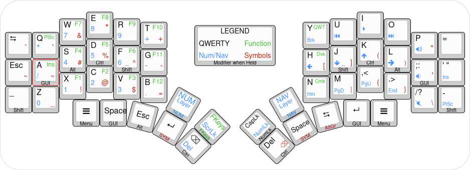

# Nev's Kyria Keymap



The default keymap contains 6 layers which allows it to include all keys found on an ANSI layout TKL keyboard plus media keys.
Hardware features of the Kyria such as OLEDs, rotary encoders and underglow are also supported.

The six different layers are the following:

1. Base layer (QWERTY)
2. Base layer (Dvorak)
3. Base layer (Colemak-DH)
4. Navigation layer
5. Symbols/Numbers layer
6. Function layer

## Base layer(s)

Three different well-known keyboard layouts are provided: QWERTY, Colemak-DH, and Dvorak. The default layer can be changed at runtime, more info on that in the section on the [Function layer](#function-layer).

For the rest of this write-up, the base layer will be assumed to be QWERTY and will be used as a reference to describe physical keys, e.g. “<kbd>B</kbd> key” vs, the much more verbose, “lower inner index key”.

```text
Base Layer: QWERTY
,-------------------------------------------.                              ,-------------------------------------------.
|  Tab   |   Q  |   W  |   E  |   R  |   T  |                              |   Y  |   U  |   I  |   O  |   P  |    =   |
|--------+------+------+------+------+------|                              |------+------+------+------+------+--------|
|  Esc   | GUI/A| Alt/S|Ctrl/D|Shft/F|   G  |                              |   H  |Shft/J|Ctrl/K| Alt/L|GUI/;:|  ' "   |
|--------+------+------+------+------+------+-------------.  ,-------------+------+------+------+------+------+--------|
|_/LShift|   Z  |   X  |   C  |   V  |   B  |NAVNUM|F-keys|  |CapsLk|NAVNUM|   N  |   M  | ,  < | . >  | /  ? |-/RShift|
`----------------------+------+------+------+------+------|  |------+------+------+------+------+----------------------'
                       | Menu | GUI/ | Alt/ | SYM/ | Ctrl/|  | Ctrl/| SYM/ |AltGr/| GUI/ | Menu |
                       |      | Space| Esc  | Enter| BkSpc|  | Del  | Space|  Tab | Enter|      |
                       `----------------------------------'  `----------------------------------'
```

```text
Base Layer: Dvorak
,-------------------------------------------.                              ,-------------------------------------------.
|  Tab   | ' "  | , <  | . >  |   P  |   Y  |                              |   F  |   G  |   C  |   R  |   L  |    =   |
|--------+------+------+------+------+------|                              |------+------+------+------+------+--------|
|  Esc   | GUI/A| Alt/O|Ctrl/E|Shft/U|   I  |                              |   D  |Shft/H|Ctrl/T| Alt/N| GUI/S|  ' "   |
|--------+------+------+------+------+------+-------------.  ,-------------+------+------+------+------+------+--------|
|_/LShift| ; :  |   Q  |   J  |   K  |   X  |NAVNUM|F-keys|  |CapsLk|NAVNUM|   B  |   M  |   W  |   V  |   Z  |-/RShift|
`----------------------+------+------+------+------+------|  |------+------+------+------+------+----------------------'
                       | Menu | GUI/ | Alt/ | SYM/ | Ctrl/|  | Ctrl/| SYM/ |AltGr/| GUI/ | Menu |
                       |      | Space| Esc  | Enter| BkSpc|  | Del  | Space|  Tab | Enter|      |
                       `----------------------------------'  `----------------------------------'
```

```text
Base Layer: Colemak DH
,-------------------------------------------.                              ,-------------------------------------------.
|  Tab   |   Q  |   W  |   F  |   P  |   B  |                              |   J  |   L  |   U  |   Y  | ;  : |    =   |
|--------+------+------+------+------+------|                              |------+------+------+------+------+--------|
|  Esc   | GUI/A| Alt/R|Ctrl/S|Shft/T|   G  |                              |   M  |Shft/N|Ctrl/E| Alt/I| GUI/O|  ' "   |
|--------+------+------+------+------+------+-------------.  ,-------------+------+------+------+------+------+--------|
|_/LShift|   Z  |   X  |   C  |   D  |   V  |NAVNUM|F-keys|  |CapsLk|NAVNUM|   K  |   H  | ,  < | . >  | /  ? |-/RShift|
`----------------------+------+------+------+------+------|  |------+------+------+------+------+----------------------'
                       | Menu | GUI/ | Alt/ | SYM/ | Ctrl/|  | Ctrl/| SYM/ |AltGr/| GUI/ | Menu |
                       |      | Space| Esc  | Enter| BkSpc|  | Del  | Space|  Tab | Enter|      |
                       `----------------------------------'  `----------------------------------'
```

## Numpad, Navigation and Media layer

```text
NUMNAV Layer: Left Numpad - Right Navigation
,-------------------------------------------.                              ,-------------------------------------------.
|        |   *  |   7  |   8  |   9  |   +  |                              | Break|M Prev|M Play|M Next| VolUp|        |
|--------+------+------+------+------+------|                              |------+------+------+------+------+--------|
|        |GUI/ /| Alt/4|Ctrl/5|Shft/6|   -  |                              |   ←  |Shft/↓|Ctrl/↑| Alt/→| GUI/ | Insert |
|        |      |      |      |      |      |                              |      |      |      |      | VolDn|        |
|--------+------+------+------+------+------+-------------.  ,-------------+------+------+------+------+------+--------|
|        |   0  |   1  |   2  |   3  |   .  |      |ScrLck|  |NumLck|      | Home | PgDn | PgUp |  End |VolMut| PrtSc  |
`----------------------+------+------+------+------+------|  |------+------+------+------+------+----------------------'
                       |      |      |      |      | Ctrl/|  | Ctrl/|      |      |      |      |
                       |      |      |      |      | Del  |  | BkSpc|      |      |      |      |
                       `----------------------------------'  `----------------------------------'
```

## Symbol layer

```text
SYMBOL Layer: Symbols
,-------------------------------------------.                              ,-------------------------------------------.
|    `   |   `  |   &  |   *  |      |   +  |                              |      |      |      |      |   "  |        |
|--------+------+------+------+------+------|                              |------+------+------+------+------+--------|
|    ~   | GUI/~| Alt/#|Ctrl/%|Shft/^|   -  |                              |   [  |Shft/]|Ctrl/(| Alt/)|GUI/' |        |
|--------+------+------+------+------+------+-------------.  ,-------------+------+------+------+------+------+--------|
|        |   _  |   !  |   @  |   $  |   =  |      |ScrLck|  |NumLck|      |      |  |   |  {   |  }   |  \   |        |
`----------------------+------+------+------+------+------|  |------+------+------+------+------+----------------------'
                       |      |      |      |      | Ctrl/|  | Ctrl/|      |      |      |      |
                       |      |      |      |      | Del  |  | BkSpc|      |      |      |      |
                       `----------------------------------'  `----------------------------------'
```

## Function layer

```text
Function Layer: Function keys
,-------------------------------------------.                              ,-------------------------------------------.
|       | PrtSc |  F7  |  F8  |  F9  | F10 |                              |QWERTY|      |      |      |      |        |
|-------+------+------+------+------+------|                              |------+------+------+------+------+--------|
|       |Insert|  F4  |  F5  |  F6  |  F11 |                              |Dvorak| Shift| Ctrl |  Alt |  GUI |        |
|-------+------+------+------+------+------+-------------.  ,-------------+------+------+------+------+------+--------|
|       |      |  F1  |  F2  |  F3  |  F12 |      |      |  |      |      |Colmak|      |      |      |      |        |
`----------------------+------+------+------+------+------|  |------+------+------+------+------+----------------------'
                       |      |      |      |      |      |  |      |      |      |      |      |
                       |      |      |      |      |      |  |      |      |      |      |      |
                       `----------------------------------'  `----------------------------------'
```

Default layer settings are included on the right.

NOTE: The default layer settings set by those keys are *NOT* stored in EEPROM and thus do not persist through boots. If you wish to change the default layer in a non-volatile manner, either change the order of the layers in the firmware, for example like so if you want to set QWERTY as the new default:

```c
enum layers {
    _QWERTY = 0,
    _DVORAK,
    _COLEMAK_DH,
    _NUMSYM,
    _NAVSYM,
    _FUNCTION,
};
```

or re-define the `QWERTY`, `COLEMAK` and `DVORAK` keys to point to custom keycodes starting on `SAFE_RANGE` and calling the `set_single_persistent_default_layer` function inside of `process_record_user`.

## Hardware Features

### Rotary Encoder

There are no rotary encoders.

### OLEDs

The OLEDs display the current layer at the top of the active layers stack, the Kyria logo and lock status (caps lock, num lock, scroll lock).

### Underglow

There are no LEDs.
